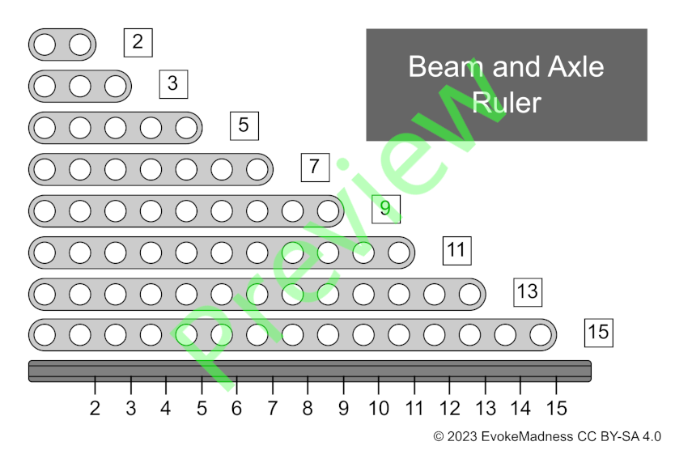
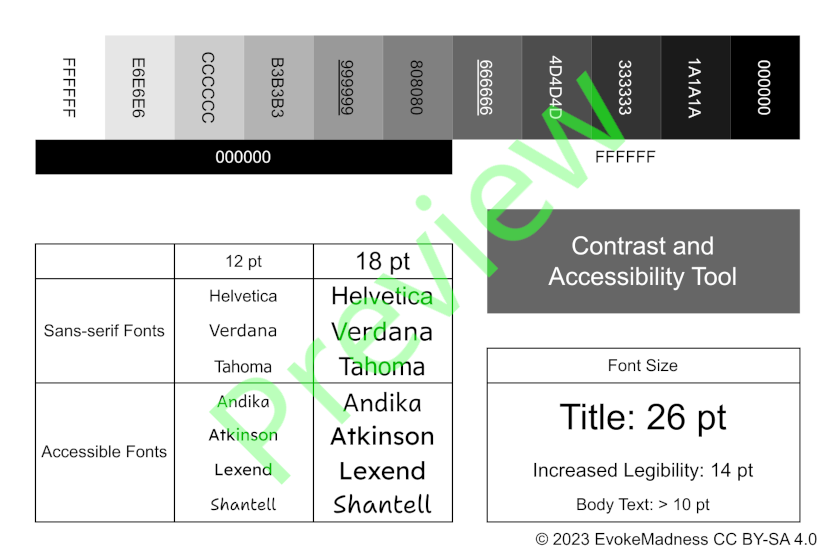
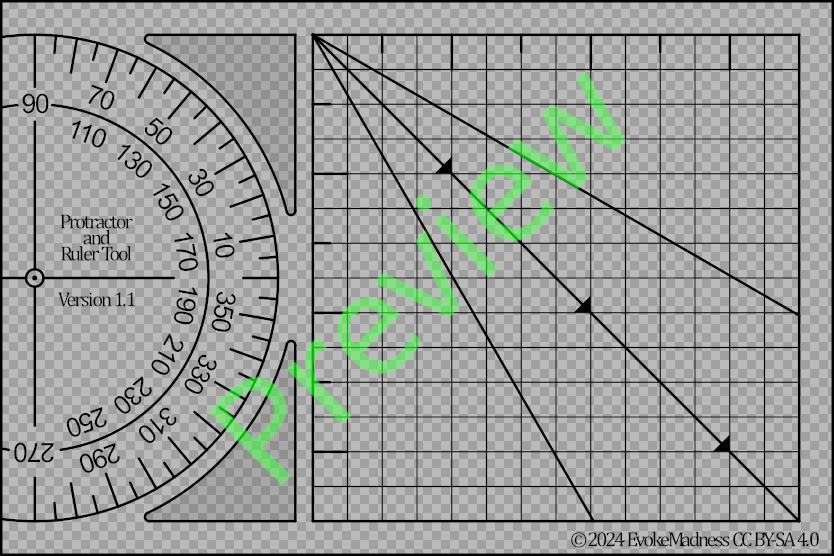

# Helpful Note Cards

## Document Previews:

### Beam and Axle Ruler
[`Download`](https://github.com/EvokeMadness/)

### Contrast and Accessibility Tool
[`Download`](https://github.com/EvokeMadness/)

### Protractor-Ruler Vellum Printable
[`Download`](https://github.com/EvokeMadness/)

## Instructions

- Print on 4 x 6 inch note cards. Do not scale.
- Print Protractor-Ruler on Vellum
	- Wait for ink to dry
	- Cut along outermost edge